# G.O.D. Tween
In other words **Great Omnicompetent Dynamics Tween**.

Tween from `inspector` and `code` any public **field / property**.

From inspector tween any class which inhertis from `UnityEngine.Object`. It means that even public fields / properties from custom scripts are possible to tween.

Tween from `code` any value.

Possible types for tweening:
- Float
- Integer
- Vector2
- Vector3
- Quaternion
- Color
- Material

## Contents
- [Installation](#installation)
- [Dictionary](#dictionary)
- [Tween](#tween)
- [Eases](#eases)
- [Sequencer](#sequencer)
- [How to use](#how-to-use)
- [Shakes](#shakes)
- [Material Tween - Renderer](#material-tween--renderer)
- [Material Tween - Graphic (UI)](#material-tween--graphic-ui)
- [Coroutines](#coroutines)
- [Async/await](#asyncawait)
- [Prewarms](#prewarms)
- [Object Pooling](#object-pooling)
- [Known Issues](#known-issues)


## Installation
Download via <a href="https://assetstore.unity.com/packages/tools/animation/g-o-d-tween-328764" target="_blank">Asset Store</a>


## Dictionary
- Tween - keeps general information about animation.
- Sequencer - container for animations, controls life, cycles and sequence of tweens.

## Tween
Object describing animation. Has information:
- what is animated
- from what value
- to what value
- ease
- duration
- delay
- actions for: update, complete, pause, play etc

> Value from animation starts is not taken in time of creation but when animation is starts after any delay.

**Available methods**
```cs
Tween OnStart(Action callback);
Tween OnStart<TTarget>(TTarget target, Action<TTarget> callback);
Tween OnBegin(Action callback);
Tween OnBegin<TTarget>(TTarget target, Action<TTarget> callback);
Tween OnUpdate(Action callback);
Tween OnUpdate<TTarget>(TTarget target, Action<TTarget> callback);
Tween OnStepComplete(Action callback);
Tween OnStepComplete<TTarget>(TTarget target, Action<TTarget> callback);
Tween OnComplete(Action callback);
Tween OnComplete<TTarget>(TTarget target, Action<TTarget> callback);
Tween OnPause(Action callback);
Tween OnPause<TTarget>(TTarget target, Action<TTarget> callback);
Tween OnPlay(Action callback);
Tween OnPlay<TTarget>(TTarget target, Action<TTarget> callback);

Tween SetDuration(float duration);
Tween SetDelay(float delay);
Tween SetEase(Ease ease);
Tween SetEase(AnimationCurve curve);

float GetDuration();
float GetDelay();

void EvaluateValue(float progress);

void Play();
void Rewind();
void Pause();
Tween SetLoops(int loops, WrapMode wrapMode = WrapMode.Default);
Tween SetKillOnFinish(bool killOnFinish);

void Dispose();
```
- **OnStart(Action callback)**
    > Sets a callback that will be fired when the tween is in the beggining (after any eventual delay). Is called once per Tween life.

- **OnStart\<TTarget\>(TTarget target, Action\<TTarget\> callback)**
    > Alloc free version OnStart.
    >
    > Sets a callback that will be fired when the tween is in the beggining (after any eventual delay). Is called once per Tween life.

- **OnBegin(Action callback)**
    > Sets a callback that will be fired when the tween is in the beggining (after any eventual delay). Is called after Start callback. Can be called several times when Tween is looped, every time when it reaches beggining of animation but always after any delay. When loop type is PingPong and goes back (reverse direction) to the beggining, callback will be called after going in forward direction after any delay.

- **OnBegin\<TTarget\>(TTarget target, Action\<TTarget\> callback)**
    > Alloc free version OnBegin.
    >
    > Sets a callback that will be fired when the tween is in the beggining (after any eventual delay). Is called after Start callback. Can be called several times when Tween is looped, every time when it reaches beggining of animation but always after any delay. When loop type is PingPong and goes back (reverse direction) to the beggining, callback will be called after going in forward direction after any delay.

- **OnUpdate(Action callback)**
    > Sets a callback that will be fired every time the tween updates, after any eventual delay.

- **OnUpdate\<TTarget\>(TTarget target, Action\<TTarget\> callback)**
    > Alloc free version OnUpdate.
    >
    > Sets a callback that will be fired every time the tween updates, after any eventual delay.

- **OnStepComplete(Action callback)**
    > Sets a callback that will be fired the moment tween reaches completion. Is called before **OnComplete**. It can be reached several times when tween is controled by tween `ITweenCore`. When Tween is lopped, callback is reached in both directions, so in the end and beggining. When Tween is looped with PingPong type it fire callback when it reach end of animation and in when it goes back when it reaches beggining of animation. When Tween is looped with Loop type then callback is reached only in the end of animation.

- **OnStepComplete\<TTarget\>(TTarget target, Action\<TTarget\> callback)**
    > Alloc free version OnStepComplete.
    >
    > Sets a callback that will be fired the moment tween reaches completion. Is called before **OnComplete**. It can be reached several times when tween is controled by tween `ITweenCore`. When Tween is lopped, callback is reached in both directions, so in the end and beggining. When Tween is looped with PingPong type it fire callback when it reach end of animation and in when it goes back when it reaches beggining of animation. When Tween is looped with Loop type then callback is reached only in the end of animation.

- **OnComplete(Action callback)**
    > Sets a callback that will be fired the moment the tween reaches completion. It can be reached several times when tween is controled by tween `ITweenCore` (e.g. every loop finished calls **OnComplete**).

- **OnComplete\<TTarget\>(TTarget target, Action\<TTarget\> callback)**
    > Alloc free version OnComplete.
    >
    > Sets a callback that will be fired the moment the tween reaches completion. It can be reached several times when tween is controled by tween `ITweenCore` (e.g. every loop finished calls **OnComplete**).

- **OnPause(Action callback)**
    > Sets a callback that will be fired when the tween state changes from playing to paused.

- **OnPause\<TTarget\>(TTarget target, Action\<TTarget\> callback)**
    > Alloc free version OnPause.
    >
    > Sets a callback that will be fired when the tween state changes from playing to paused.

- **OnPlay(Action callback)**
    > Sets a callback that will be fired when the tween is set in a playing state, after any eventual delay. Also called each time the tween resumes playing from a paused state.

- **OnPlay\<TTarget\>(TTarget target, Action\<TTarget\> callback)**
    > Alloc free version OnPlay.
    >
    > Sets a callback that will be fired when the tween is set in a playing state, after any eventual delay. Also called each time the tween resumes playing from a paused state.

- **SetDuration(float duration)**
    > Set information about animation length.

- **SetDelay(float delay)**
    > Set information about animation delay, time before animation starts.

- **SetEase(Ease ease)**
    > Set ease.

- **SetEase(AnimationCurve curve)**
    > Set animation curve.

- **GetDuration()**
    > Returns information about animation length.

- **GetDelay()**
    > Returns information about animation delay.

- **EvaluateValue(float progress)**
    > Evaluates animation by progress between *0-1*.
    > Value is overrided by controls from ITweenCore after *Play*.
    > If you want to use it make sure you don't play tween so you can control value manually.

- **Play()**
    > Start animation from current state.
    >
    > Callback `OnPlay` is called after use of this method. Is called only when animation was not played or stopped before usage.

- **Rewind()**
    > Play animation in opposite direction from current state.

- **Pause()**
    > Stop animation.
    >
    > Callback `OnPause` is called after use of this method. Is called only when animation was in playing state before usage.

- **SetLoops(int loops, WrapMode wrapMode = WrapMode.Default)**
    > Set information how many repeats animation has to do.
    > To achieve infinite sequence pass *-1* as parameter.
    >
    > Set Tween repeat behaviour: Default, Loop or PingPong.

- **SetKillOnFinish(bool killOnFinish)**
    > Set information if animation should be diposed / killed after finish.

- **Dispose()**
    > Kills tween.

>*Additonal note:*
>
>Methods `Play` and `Rewind` wrap Tween inside `ITweenCore` as `Sequencer`.
>
>So when you `Play/Rewind` Tween, it plays `Sequencer` with just created Tween.

## Eases
- Custom, // for animation curve
- Linear,
- InSine,
- OutSine,
- InOutSine,
- InQuad,
- OutQuad,
- InOutQuad,
- InCubic,
- OutCubic,
- InOutCubic,
- InQuart,
- OutQuart,
- InOutQuart,
- InQuint,
- OutQuint,
- InOutQuint,
- InExpo,
- OutExpo,
- InOutExpo,
- InCirc,
- OutCirc,
- InOutCirc,
- InElastic,
- OutElastic,
- InOutElastic,
- InBack,
- OutBack,
- InOutBack,
- InBounce,
- OutBounce,
- InOutBounce

## Sequencer
Container for tweens.

Controls time for tweening, direction, cycles and actions like `Play`, `Pause` and also life of tweens.

`Sequencer` implements `IDisposable` pattern. It gives developer more tools of controling object life.

From default when all animations are finished tweens are killed (disposed).
This behaviour can be overrided using method `SetKillOnFinish`.

**Available methods:**
```cs
bool IsAnimating { get; }
ITweenCore OnStart(Action callback);
ITweenCore OnStart<TTarget>(TTarget target, Action<TTarget> callback);
ITweenCore OnBegin(Action callback);
ITweenCore OnBegin<TTarget>(TTarget target, Action<TTarget> callback);
ITweenCore OnPlay(Action callback);
ITweenCore OnPlay<TTarget>(TTarget target, Action<TTarget> callback);
ITweenCore OnUpdate(Action callback);
ITweenCore OnUpdate<TTarget>(TTarget target, Action<TTarget> callback);
ITweenCore OnStepComplete(Action callback);
ITweenCore OnStepComplete<TTarget>(TTarget target, Action<TTarget> callback);
ITweenCore OnComplete(Action callback);
ITweenCore OnComplete<TTarget>(TTarget target, Action<TTarget> callback);
ITweenCore OnPause(Action callback);
ITweenCore OnPause<TTarget>(TTarget target, Action<TTarget> callback);

int TweenCount();
float GetDuration();
float GetTime();
ITweenCore SetLoops(int loops);
ITweenCore SetUpdateMode(UpdateMode mode);
ITweenCore SetIgnoreTimeScale(bool ignoreTimeScale);
ITweenCore SetKillOnFinish(bool killOnFinish);
ITweenCore EvaluateValueFromProgress(float progress, bool isTotal = false);
ITweenCore EvaluateValueFromTime(float time, bool isTotal = false);

ITweenCore Play();
ITweenCore Rewind();
ITweenCore Pause();

ITweenCore Chain(Tween tween);
ITweenCore Group(Tween tween);
ITweenCore Group(params Tween[] tweens);
ITweenCore Insert(float time, Tween tween);

void Dispose();
```

- **IsAnimating { get; }** 
    > Returns information if animation is in progress.

- **OnStart(Action callback)**
    > Sets a callback that will be fired once when the tween core starts (meaning when the tween core is set in a playing state the first time).

- **OnStart\<TTarget\>(TTarget target, Action\<TTarget\> callback)**
    > Alloc free version OnStart.
    > 
    > Sets a callback that will be fired once when the tween core starts (meaning when the tween core is set in a playing state the first time).

- **OnBegin(Action callback)**
    > Sets a callback that will be fired when the tween is in the beggining. Is called after Start callback. Can be called several times when is looped, every time when it reaches beggining of animation.

- **OnBegin\<TTarget\>(TTarget target, Action\<TTarge\> callback)**
    > Alloc free version OnBegin.
    > 
    > Sets a callback that will be fired when the tween is in the beggining. Is called after Start callback. Can be called several times when is looped, every time when it reaches beggining of animation.

- **OnPlay(Action callback)**
    > Sets a callback that will be fired when the tween core is set in a playing state. Also called each time the tween core resumes playing from a paused state.

- **OnPlay\<TTarget\>(TTarget target, Action\<TTarget\> callback)**
    > Alloc free version OnPlay.
    > 
    > Sets a callback that will be fired when the tween core is set in a playing state. Also called each time the tween core resumes playing from a paused state.

- **OnUpdate(Action callback)**
    > Sets a callback that will be fired every time the tween core updates. Update must be done by tick so every Update, FixedUpdate or LateUpdate.

- **OnUpdate\<TTarget\>(TTarget target, Action\<TTarget\> callback)**
    > Alloc free version OnUpdate.
    > 
    > Sets a callback that will be fired every time the tween core updates. Update must be done by tick so every Update, FixedUpdate or LateUpdate.

- **OnStepComplete(Action callback)**
    > Sets a callback that will be fired each time the tween completes a single loop cycle (meaning that, if you set your loops to 3, OnStepComplete will be called 3 times, contrary to **OnComplete** which will be called only once at the very end). For PingPong loop step is completed when full cycle is finished.

- **OnStepComplete\<TTarget\>(TTarget target, Action\<TTarget\> callback)**
    > Alloc free version OnStepComplete.
    > 
    > Sets a callback that will be fired each time the tween completes a single loop cycle (meaning that, if you set your loops to 3, OnStepComplete will be called 3 times, contrary to **OnComplete** which will be called only once at the very end). For PingPong loop step is completed when full cycle is finished.

- **OnComplete(Action callback)**
    > Sets a callback that will be fired the moment the tween reaches completion, all loops included.

- **OnComplete\<TTarget\>(TTarget target, Action\<TTarget\> callback)**
    > Alloc free version OnComplete.
    > 
    > Sets a callback that will be fired the moment the tween reaches completion, all loops included.

- **OnPause(Action callback)**
    > Sets a callback that will be fired when the tween core state changes from playing to paused.

- **OnPause\<TTarget\>(TTarget target, Action\<TTarget\> callback)**
    > Alloc free version OnPause.
    > 
    > Sets a callback that will be fired when the tween core state changes from playing to paused.

- **TweenCount()**
    > Returns count of tweens sequencer controls.

- **GetDuration()**
    > Returns information how long whole sequnce lasts.

- **GetTime()**
    > Returns current time information between *0-duration*.

- **SetLoops(int loops)**
    > Set information how many repeats sequencer has to do.
    >
    > To achieve infinite sequence pass *-1* as parameter.

- **SetUpdateMode(UpdateMode mode)**
    > Set information if sequence should be run in Update, FixedUpdate or LateUpdate.

- **SetIgnoreTimeScale(bool ignoreTimeScale)**
    > Set information if sequence should respect time scale.

- **SetKillOnFinish(bool killOnFinish)**
    > Set information if Sequencer should be killed / disposed after finish.
    >
    > When sequence is set to be infinite then it won't be killed. In that situation good practice is to Dispose it when not in use.

- **EvaluateValueFromProgress(float progress, bool isTotal = false)**
    > Evaluate sequence base on progress, between *0-1*.
    >
    > **isTotal false**: evaluation is in scope of sequence from start to end.
    >
    > **isTotal true**: evaluation is in scope of whole sequence in account with loops. When loops are set to *-1* then evaluation works in scope of sequence from start to end, the same way like in situation when *isTotal = false*.

- **EvaluateValueFromTime(float time, bool isTotal = false)**
    > Evaluate sequence base on time, between *0-duration*.
    >
    > **isTotal false**: evaluation is in scope of sequence from start to end.
    >
    > **isTotal true**: evaluation is in scope of whole sequence in account with loops. When loops are set to *-1* then evaluation works in scope of sequence from start to end, the same way like in situation when *isTotal = false*.
    
- **Play()**
    > Play sequence from current state.
    >
    > Callback `OnPlay` is called after use of this method. Is called only when animation was not played or stopped before usage.

- **Rewind()**
    > Play sequence in opposite direction from current state.

- **Pause()**
    > Stop animation.
    >
    > Callback `OnPause` is called after use of this method. Is called only when animation was in playing state before usage.

- **Chain(Tween tween)**
    > Places animation after all previously added animations in sequence. Chained animations run sequentially after one another.

- **Chain(ITweenCore sequence)**
    > It creates totaly new group from tweens in provided sequence. Tweens are copied to current sequnce. Group will start after previous Tween or Group finish. Provided sequence would be killed to prevent any leaks.

- **Group(Tween tween, bool isNewGroup = false)**
    > Groups animations in Sequence. 
    >
    > When you call **Group** for the first time, it creates a new group of animations that will start after the previous animation in the sequence finishes. 
    >
    > If a group already exists, calling **Group** again will add the new animation to the same group, so all animations in that group run simultaneously. 
    >
    > The total duration of the group is determined by the longest animation in the group, including any delays. 
    >
    > Once the group finishes (based on its total duration), the sequencer will move on to the next animation in the sequence.

- **Group(params Tween[] tweens)**
    > It creates totaly new group with provided collection of tweens. Even though previously tweens where added using `Group(Tween tween)` method. Using this method will start new group which will start after previous Tween or Group finish.

- **Group(ITweenCore sequence, bool isNewGroup = false)**
    > Tweens are copied to current sequnce. If current sequence has already existing group then tweens will be added there. If not then new group will be created with provided tweens. Same behaviour when flag `isNewGroup` true. Provided sequence would be killed to prevent any leaks.

- **Insert(float time, Tween tween)**
    > Adds tween into specific time in sequence. Added tweens is not affected by any groups an chains.

- **Insert(float time, ITweenCore sequence)**
    > Adds all tweens from one sequence into specific time in current sequence. Added tweens is not affected by any groups an chains.

- **Dispose()**
    > Kills sequence together with all tweens it contains.

### Sequencing tweens
You can add tweens to sequence using `Chain`, `Group` or `Insert`.

#### Chain
Places animation after all previously added animations in sequence. Chained animations run sequentially after one another.

#### Group
Groups animations in Sequence. 

When you call **Group** for the first time, it creates a new group of animations that will start after the previous animation in the sequence finishes. 

If a group already exists, calling **Group** again will add the new animation to the same group, so all animations in that group run simultaneously. 

The total duration of the group is determined by the longest animation in the group, including any delays. 

Once the group finishes (based on its total duration), the sequencer will move on to the next animation in the sequence.

#### Insert

Place animation in provided time in sequence.

### How to create `Sequencer` from code
```cs
WrapMode wrapMode; // set here wrap mode
var sequencer = GODTween.Core.CreateSequencer(wrapMode);

sequencer.Chain(tween1.SetDuration(1.0f));
// tween2 will be played after 1s delay
sequencer.Group(tween2.SetDuration(0.5f));
// tween3 will be also played after 1s delay, simultaneously with tween2
sequencer.Group(tween3.SetDuration(2.0f));
// tween4 will be played when last group (tween2 + tween3) is finished so in total (3s) after tween1 + longest animation in last group
sequencer.Chain(tween4.SetDuration(0.5f));
```

### Wrap Modes
- **Default** - animate once till end
- **Loop** - animate to number of loops, loop starts from the beggining
- **PingPong** - animate to number of loops, rewinds animation to the beggining, one loops is counted when it goes back to the beggining, (1 loop = forward + backward)

Only `Loop` and `PingPong` allows to set number of loops. Default number of loops is 1

Infinite animation can be achieved by passing **-1** as number of loops. Be aware that `OnComplete` will be never invoked.

## How to use
There is several ways to use `G.O.D. Tween`
- [Inspector](#inspector)
- [Code](#code)

### Inspector
You can use friendly inspector for creating animations.

Attach component `GODTweenSequencer` to your object then add animations under `Tween Containers` using '+' sign.

Select between `Chain`, `Group` or `Insert` and start describing tweens.

After selecting `Group` you must add tweens to it using also '+' sign.

Once you added animation element add `Target` object select `Animation Type` and then under Target object `Select field/property to animate`, it will show list of elements possible to animate.

Fill in other information like `Delay`, `Duration`, `Ease`, value to animate etc.

#### General View

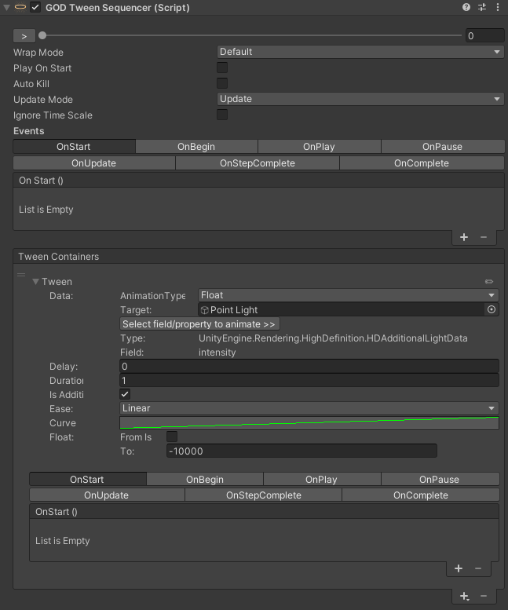

#### Possible types to tween

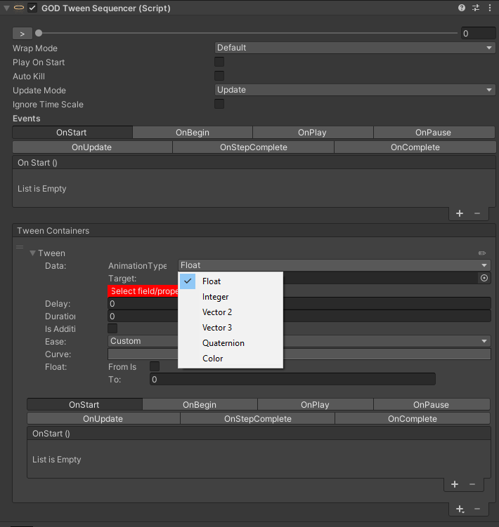

#### Selecting field/property to tween

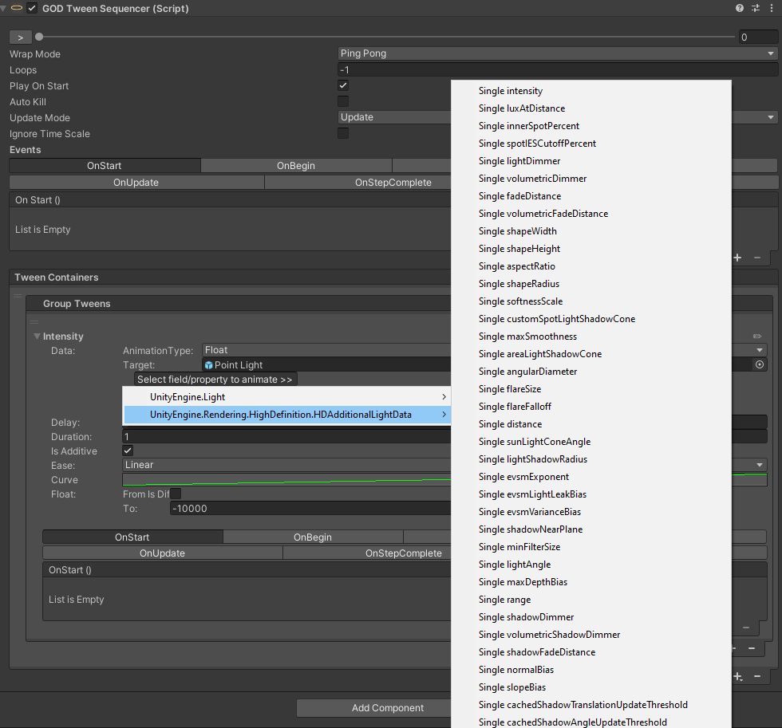

> The field selector searches recursively into nested custom types (up to 5 levels deep). Fields from nested objects appear with dot-notation paths, e.g. `MyScript/subObject/speed`. This allows tweening deeply nested values without any extra setup.

#### Everything possible

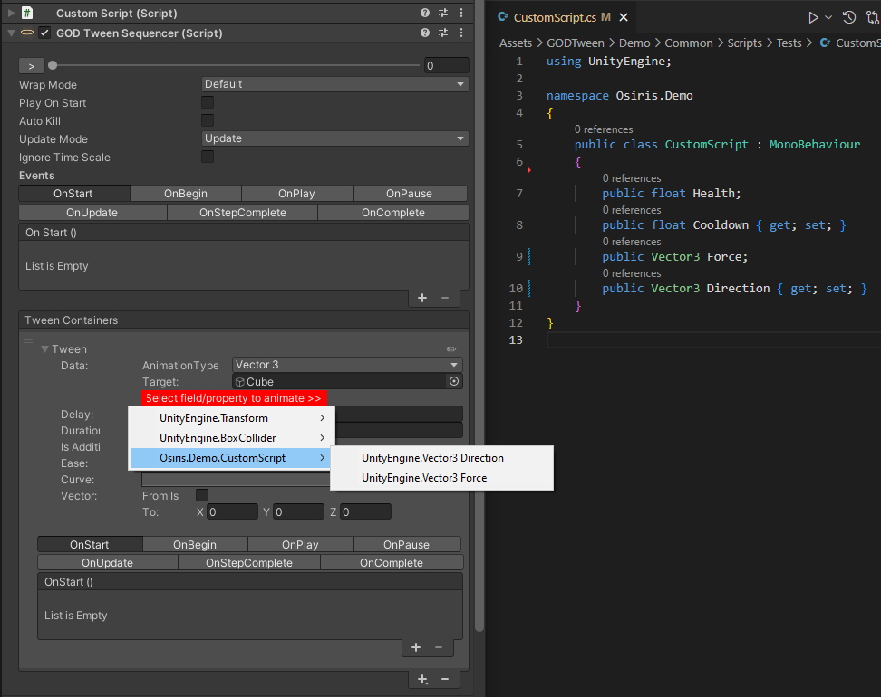

#### Preview

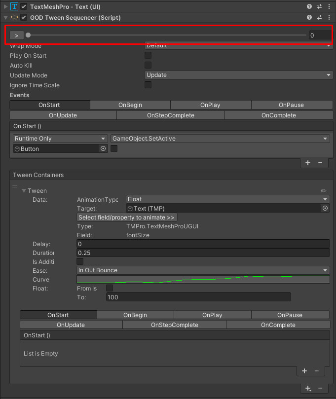

#### Creating sequence / groups

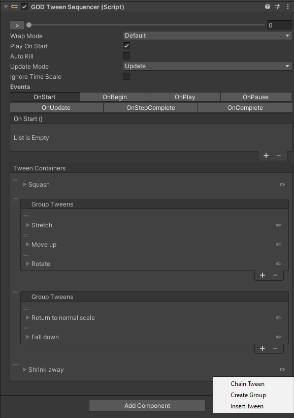

#### Rename added tweens

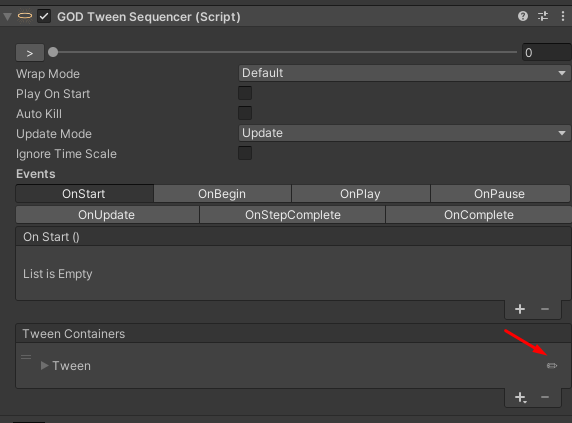

### Code

There are three ways to create animation from code:
- [Creator](#creator)
- [**UnityEngine.Object** Extension](#extension)
- [Virtual](#virtual)

#### Creator
```cs
GODTween.Tween.Create<T>(string name, float to, float? from = null, bool isAdditive = false);
GODTween.Tween.Create<T>(string name, int to, int? from = null, bool isAdditive = false);
GODTween.Tween.Create<T>(string name, Vector2 to, Vector2? from = null, bool isAdditive = false);
GODTween.Tween.Create<T>(string name, Vector3 to, Vector3? from = null, bool isAdditive = false);
GODTween.Tween.Create<T>(string name, Quaternion to, Quaternion? from = null, bool isAdditive = false);
GODTween.Tween.Create<T>(string name, Color to, Color? from = null, bool isAdditive = false);
GODTween.Tween.Create(Renderer renderer, string propertyName, float to, float? from = null, int materialIndex = 0, bool isAdditive = false);
GODTween.Tween.Create(Renderer renderer, string propertyName, Color to, Color? from = null, int materialIndex = 0, bool isAdditive = false);
GODTween.Tween.Create(Renderer renderer, string propertyName, Vector4 to, Vector4? from = null, int materialIndex = 0, bool isAdditive = false);
GODTween.Tween.Create(Graphic graphic, string propertyName, float to, float? from = null, bool isAdditive = false);
GODTween.Tween.Create(Graphic graphic, string propertyName, Color to, Color? from = null, bool isAdditive = false);
GODTween.Tween.Create(Graphic graphic, string propertyName, Vector4 to, Vector4? from = null, bool isAdditive = false);
GODTween.Tween.Delay(float delay);
```

When you play `Tween` it wraps it in `Sequencer` with default wrap mode.

When `from` is not provided then it uses current value as start value. Current value is taken after any delay.

Creating `Tween` just creates it but not Play it automatically, to play it, use method `Play`.

**Usage Example**
```cs
[SerializeField] private UnityEngine.UI.Button _button1;

// play it in method
GODTween.Tween.Create(_button1.transform, nameof(Transform.localScale), new Vector3(1.2f, 1.0f, 1.0f), Vector3.one)
    .OnStart(() => _button1.interactable = false)
    .OnComplete(() => _button1.interactable = true)
    .SetEase(Ease.InBounce)
    .SetDuration(0.25f)
    .Play();

// Material property
GODTween.Tween.Create(GetComponent<Renderer>(), "_Metallic", 1.0f, 0.0f)
    .SetDuration(1.0f)
    .SetEase(Ease.InOutQuad)
    .Play();
```

### Extension
```cs
public static Tween ToTween<T>(this T component, string fieldName, float to, float? from = null, bool isAdditive = false) where T : UnityEngine.Object;
public static Tween ToTween<T>(this T component, string fieldName, int to, int? from = null, bool isAdditive = false) where T : UnityEngine.Object;
public static Tween ToTween<T>(this T component, string fieldName, Vector2 to, Vector2? from = null, bool isAdditive = false) where T : UnityEngine.Object;
public static Tween ToTween<T>(this T component, string fieldName, Vector3 to, Vector3? from = null, bool isAdditive = false) where T : UnityEngine.Object;
public static Tween ToTween<T>(this T component, string fieldName, Quaternion to, Quaternion? from = null, bool isAdditive = false) where T : UnityEngine.Object;
public static Tween ToTween<T>(this T component, string fieldName, Color to, Color? from = null, bool isAdditive = false) where T : UnityEngine.Object;
public static Tween ToTween(this Renderer renderer, string propertyName, float to, float? from = null, int materialIndex = 0, bool isAdditive = false);
public static Tween ToTween(this Renderer renderer, string propertyName, Color to, Color? from = null, int materialIndex = 0, bool isAdditive = false);
public static Tween ToTween(this Renderer renderer, string propertyName, Vector4 to, Vector4? from = null, int materialIndex = 0, bool isAdditive = false);
public static Tween ToTween(this Graphic graphic, string propertyName, float to, float? from = null, bool isAdditive = false);
public static Tween ToTween(this Graphic graphic, string propertyName, Color to, Color? from = null, bool isAdditive = false);
public static Tween ToTween(this Graphic graphic, string propertyName, Vector4 to, Vector4? from = null, bool isAdditive = false);
```

**Usage Example**
```cs
_button1.transform.ToTween(nameof(Transform.localScale), new Vector3(1.2f, 1.0f, 1.0f), Vector3.one)
                .OnStart(() => _button1.interactable = false)
                .OnComplete(() => _button1.interactable = true)
                .SetEase(Ease.InBounce)
                .SetDuration(0.25f)
                .Play();

// Material property
GetComponent<Renderer>().ToTween("_Color", Color.red)
    .SetDuration(0.5f)
    .Play();
```

#### Virtual
```cs
GODTween.Virtual.Create<float>(Action<float> setter, float from, float to, float duration);
GODTween.Virtual.Create<int>(Action<int> setter, int from, int to, float duration);
GodTween.Virtual.Create<Vector2>(Action<Vector2> setter, Vector2 from, Vector2 to, float duration);
GODTween.Virtual.Create<Vector3>(Action<Vector3> setter, Vector3 from, Vector3 to, float duration);
GODTween.Virtual.Create<Color>(Action<Color> setter, Color from, Color to, float duration);
GODTween.Virtual.Create<Quaternion>(Action<Quaternion> setter, Quaternion from, Quaternion to, float duration);
```

**Usage Example**
```cs
float value = 0.0f;
GODTween.Virtual.Create((x) => value = x, 2.0f, 8.0f, 3.0f).Play();

void UpdateValue(float newValue) => value = newValue;
GODTween.Virtual.Create(UpdateValue, 2.0f, 8.0f, 3.0f).Play();
```

Material properties can also be animated through Virtual by providing a custom setter:
```cs
var renderer = GetComponent<Renderer>();
var block = new MaterialPropertyBlock();
GODTween.Virtual.Create<float>(value => {
    renderer.GetPropertyBlock(block);
    block.SetFloat("_Metallic", value);
    renderer.SetPropertyBlock(block);
}, 0f, 1f, 1f).Play();
```

### Shakes
GODTween plugin provides ready solution for creating shakes.

Like for main approach for creating tweens, there is possibility to create shakes for types:
- Integer
- Float
- Vector2
- Vector3
- Quaternion
- Color

Shake is just sequence of prepared tweens, so it returns ITweenCore.

```cs
public ITweenCore ShakeInt<T>(T component, string fieldName, float duration, float strength, int vibrato, bool fadeOut) where T : UnityEngine.Object

public ITweenCore ShakeFloat<T>(T component, string fieldName, float duration, float strength, int vibrato, bool fadeOut) where T : UnityEngine.Object

public ITweenCore ShakeVector3<T>(T component, string fieldName, float duration, float strength, int vibrato, bool fadeOut, TweenAxis axis) where T : UnityEngine.Object

public ITweenCore ShakeVector2<T>(T component, string fieldName, float duration, float strength, int vibrato, bool fadeOut, TweenAxis axis) where T : UnityEngine.Object

public ITweenCore ShakeQuaternion<T>(T component, string fieldName, float duration, float strength, int vibrato, bool fadeOut, TweenAxis axis) where T : UnityEngine.Object

public ITweenCore ShakeColor<T>(T component, string fieldName, float duration, float strength, int vibrato, bool fadeOut, TweenColorChannel colorChannel) where T : UnityEngine.Object
```

**Usage Example**
```cs
var duration = 0.5f;
var strength = 1.0f;
var vibrato = 10;
var fadeOut = true;
GODTween.Shaker.ShakeVector3(_parent.transform, nameof(Transform.position), duration, strength, vibrato, fadeOut, TweenAxis.Everything).Play();
```

### Extensions
```cs
public static ITweenCore ToShakeInt<T>(this T component, string fieldName, float duration, float strength, int vibrato, bool fadeOut) where T : UnityEngine.Object

public static ITweenCore ToShakeFloat<T>(this T component, string fieldName, float duration, float strength, int vibrato, bool fadeOut) where T : UnityEngine.Object

public static ITweenCore ToShakeVector3<T>(this T component, string fieldName, float duration, float strength, int vibrato, bool fadeOut, TweenAxis axis) where T : UnityEngine.Object

public static ITweenCore ToShakeVector2<T>(this T component, string fieldName, float duration, float strength, int vibrato, bool fadeOut, TweenAxis axis) where T : UnityEngine.Object

public static ITweenCore ToShakeQuaternion<T>(this T component, string fieldName, float duration, float strength, int vibrato, bool fadeOut, TweenAxis axis) where T : UnityEngine.Object

public static ITweenCore ToShakeColor<T>(this T component, string fieldName, float duration, float strength, int vibrato, bool fadeOut, TweenColorChannel colorChannel) where T : UnityEngine.Object
```

## Material Tween - Renderer
Animate shader properties on a `Renderer` component. Supported property types: `float`, `Color`, `Vector4`.

Uses `MaterialPropertyBlock` internally (non-destructive), does not modify the material asset.

### Creator
```cs
GODTween.Tween.Create(Renderer renderer, string propertyName, float to, float? from = null, int materialIndex = 0, bool isAdditive = false);
GODTween.Tween.Create(Renderer renderer, string propertyName, Color to, Color? from = null, int materialIndex = 0, bool isAdditive = false);
GODTween.Tween.Create(Renderer renderer, string propertyName, Vector4 to, Vector4? from = null, int materialIndex = 0, bool isAdditive = false);
```

- `propertyName` - shader property name, e.g. `"_Color"`, `"_Metallic"`, `"_UV_Offset"`
- `materialIndex` - index of material on renderer (default: 0)
- `isAdditive` - if true, adds value to current property value instead of replacing it

### Extension
```cs
renderer.ToTween(string propertyName, float to, float? from = null, int materialIndex = 0, bool isAdditive = false);
renderer.ToTween(string propertyName, Color to, Color? from = null, int materialIndex = 0, bool isAdditive = false);
renderer.ToTween(string propertyName, Vector4 to, Vector4? from = null, int materialIndex = 0, bool isAdditive = false);
```

**Usage Example**
```cs
// Animate _Metallic float property
GetComponent<Renderer>().ToTween("_Metallic", 1.0f, 0.0f)
    .SetDuration(1.0f)
    .SetEase(Ease.InOutQuad)
    .Play();

// Animate _Color
GetComponent<Renderer>().ToTween("_Color", Color.red)
    .SetDuration(0.5f)
    .Play();

// Additive UV scrolling
GetComponent<Renderer>().ToTween("_UV_Offset", new Vector4(1, 0, 0, 0), isAdditive: true)
    .SetDuration(2.0f)
    .SetLoops(-1, WrapMode.Loop)
    .Play();
```

## Material Tween - Graphic (UI)
Animate shader properties on a `Graphic` component (`Image`, `RawImage`, and any other class that inherits from `UnityEngine.UI.Graphic`). Supported property types: `float`, `Color`, `Vector4`.

Writes directly to `graphic.material` (no `MaterialPropertyBlock`). On first use, if the Graphic is still using its `defaultMaterial`, a new material instance is created automatically - this breaks draw-call batching for that element.

> **Note:** There is no `materialIndex` parameter - a `Graphic` component always has a single material.

### Creator
```cs
GODTween.Tween.Create(Graphic graphic, string propertyName, float to, float? from = null, bool isAdditive = false);
GODTween.Tween.Create(Graphic graphic, string propertyName, Color to, Color? from = null, bool isAdditive = false);
GODTween.Tween.Create(Graphic graphic, string propertyName, Vector4 to, Vector4? from = null, bool isAdditive = false);
```

- `propertyName` - shader property name, e.g. `"_Color"`, `"_Cutoff"`, `"_TexOffset"`
- `isAdditive` - if true, adds value to current property value instead of replacing it

### Extension
```cs
graphic.ToTween(string propertyName, float to, float? from = null, bool isAdditive = false);
graphic.ToTween(string propertyName, Color to, Color? from = null, bool isAdditive = false);
graphic.ToTween(string propertyName, Vector4 to, Vector4? from = null, bool isAdditive = false);
```

**Usage Example**
```cs
// Animate a custom shader color property on an Image
GetComponent<Image>().ToTween("_Color", Color.red)
    .SetDuration(0.5f)
    .Play();

// Animate a float property (e.g. dissolve threshold)
GetComponent<Image>().ToTween("_Cutoff", 1.0f, 0.0f)
    .SetDuration(1.0f)
    .SetEase(Ease.InOutQuad)
    .Play();
```

## Exceptions

Plugin has it's own exception `GODTweenException`, every problem which can occur inside plugin will throw this exception.

## Coroutines
It is possible to control `Tween` and `ITweenCore` using coroutines by calling **ToYieldInstruction**.

**Usage Example**
```cs
private CancellationTokenSource _cts = new CancellationTokenSource();
private IEnumerator Coroutine()
{
    yield return _textMeshPro.ToTween(nameof(TextMeshProUGUI.fontSize), 99.0f).ToYieldInstruction(_cts.Token);
}
```
Method `ToYieldInstruction` get optional parameter CancellationToken token. It's recommended to pass there token so there is possibility control animation life when Coroutine is killed before finish.

Creating `ToYieldInstruction` from `Tween` or `ITweenCore` will automatically `Play` it.

When you want to kill Coroutine faster than animation is finished it's recommended to cancel token to avoid any memory leaks.

## Async/await
### UniTask Support
It is possible to convert `Tween` and `ITweenCore` to [`UniTask`](https://github.com/Cysharp/UniTask)

In general plugin should handle automatically support for UniTask if it already exist or is added after.

If not, then to make sure it works add to define symbols `GODTWEEN_UNITASK_ENABLED`; 

If you use `asmdef` then add to yours assembly also `GODTween.UniTask`.

After creating animation you can convert it to `UniTask`. 

Creating `UniTask` from `Tween` or `ITweenCore` will automatically `Play` it.

**Usage Example**
```cs
private async UniTask Example(CancellationToken token)
{
    // do smth before task
    try
    {
        await GODTween.Tween.Create(_button1.transform, nameof(Transform.localScale), new Vector3(1.2f, 1.0f, 1.0f), Vector3.one)
            .OnStart(() => _button1.interactable = false)
            .OnComplete(() => _button1.interactable = true)
            .SetEase(Ease.InBounce)
            .SetDuration(0.25f).ToUniTask(token);
    }
    catch (OperationCanceledException)
    {
    }
    // do smth after finish
}
```

Method `ToUniTask` get optional parameter `CancellationToken token`. It's recommended to pass there token so there is possibility to stop task execution.

> Note: canceling token while animation is in progress dispose (kills) `Tween`.

### Task support
It is possible to convert `Tweens` and `TweenCores` to `Tasks`. Soultion is available without any additional setup.

After creating animation you can convert it to `Task`. 

Creating `Task` from `Tween` or `ITweenCore` will automatically `Play` it.

**Usage Example**
```cs
private async Task Example(CancellationToken token)
{
    // do smth before task
    try
    {
        await GODTween.Tween.Create(_button1.transform, nameof(Transform.localScale), new Vector3(1.2f, 1.0f, 1.0f), Vector3.one)
            .OnStart(() => _button1.interactable = false)
            .OnComplete(() => _button1.interactable = true)
            .SetEase(Ease.InBounce)
            .SetDuration(0.25f).ToTask(token);
    }
    catch (OperationCanceledException)
    {
    }
    // do smth after finish
}
```

Method `ToTask` get optional parameter `CancellationToken token`. It's recommended to pass there token so there is possibility to stop task execution.

> Note: canceling token while animation is in progress dispose (kills) `Tween`.

## Prewarms

To make this plugin so much powerful, it runs on reflection to create accessors like setters and getters. To fight any allocations, setters and getters are created and cached when first time created. That's why I recommend to prewarm some tweens to avoid any spikes in gameplay. For this purpouse is created prewarm editor. From top menu select: `Tools > Osiris > GODTween > Prewarm Generator`.

It will open `Tween Prewarm Generator`.

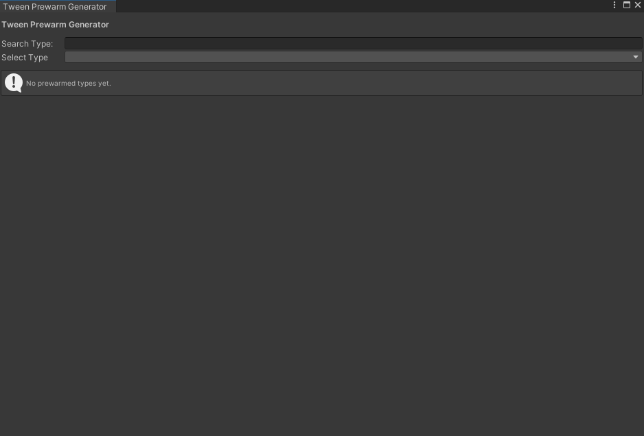

Use search type to narrow founded scripts and then click select type to find wanted type.

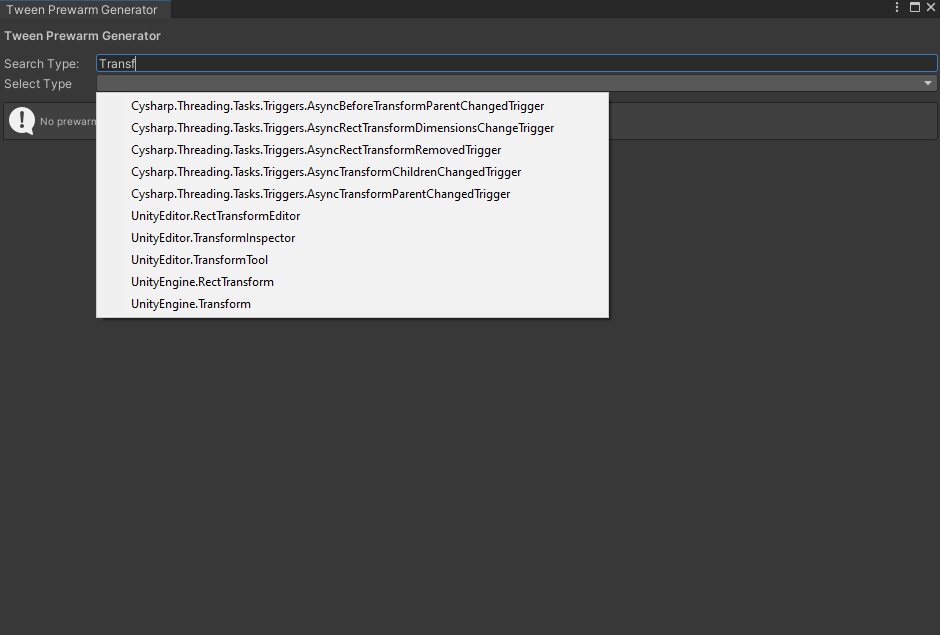

After selecting type scan fields and properties which are possible to tween.

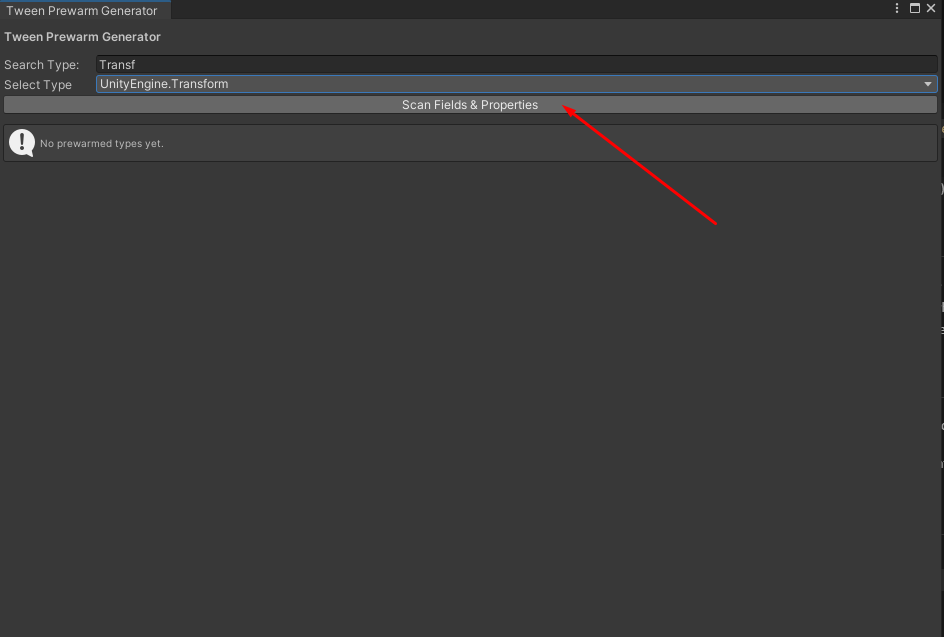

Select which one you want to prewarm and confirm with button `Add to Prewarm List`. It will create scriptable object in directory: `Assets/GODTween/Resources/TweenPrewarmData`. Don't change directory or name because it's place from where GODTween will get information what must be prewarmed before play.

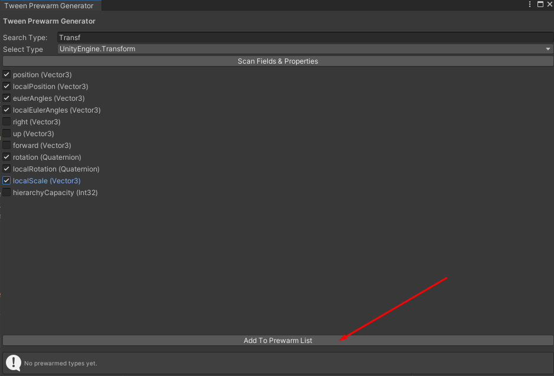

Information about current selected types will be inside `Currently Prewarmed Types`. Additionaly it's possible to remove any already selected type clicking "X" button.

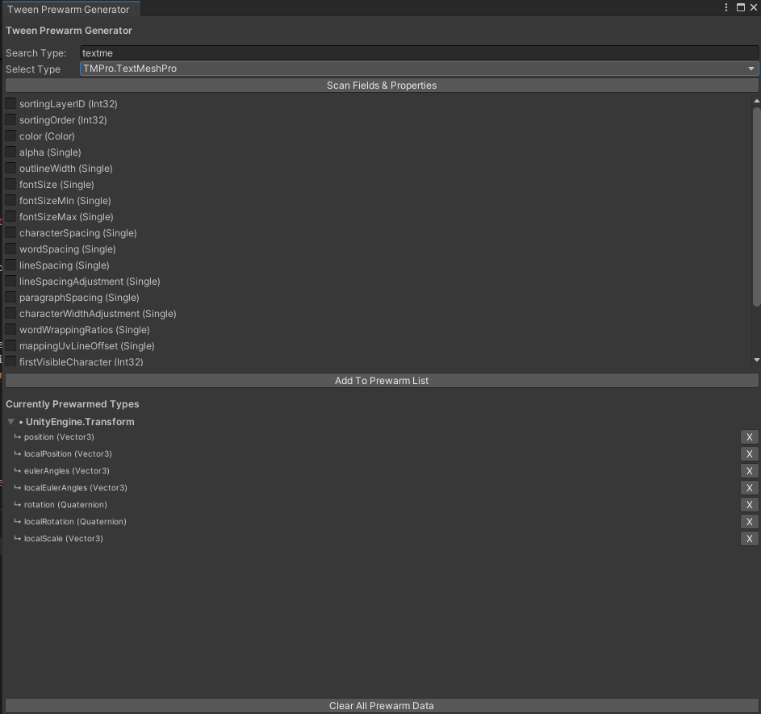

For smooth start some types were already added to prewarms:
- UnityEngine.Transform position
- UnityEngine.Transform localPosition
- UnityEngine.Transform eulerAngles
- UnityEngine.Transform localEulerAngles
- UnityEngine.Transform rotation
- UnityEngine.Transform localRotation
- UnityEngine.Transform localScale

## Object Pooling
GODTween uses object pooling to reuse tween instances and reduce GC pressure. Pooling is **enabled by default**.

To configure:
```cs
// Disable pooling
GODTween.ConfigurePool(enabled: false);

// Enable with custom pool size per tween type
GODTween.ConfigurePool(enabled: true, maxPerType: 64);
```

- `maxPerType` - maximum number of pooled instances per tween type (default: 32)

Pooling is transparent - tween creation and disposal work exactly the same. When a tween is disposed, it is returned to the pool and its state (callbacks, values, guid) is fully reset before reuse.

## Known Issues

- If you manually change a value on an object that is already controlled by a `GODTweenSequencer`, the modification may not take effect.

    A simple workaround is to turn off `GODTweenSequencer` component, change value and turn on it again.

- In some cases, changes made in the Inspector are not reflected in the live preview immediately.
The last added value are only applied after the field loses focus or the Inspector refreshes.

    This happens because Unity delays applying serialized property changes while a field is being edited.
    As a result, the preview may use outdated data until Unity commits the changes internally.

    If the preview doesn’t update right away, briefly click outside the edited field or reselect the object to refresh the preview. Turn off and on `GODTweenSequencer` component also works.
